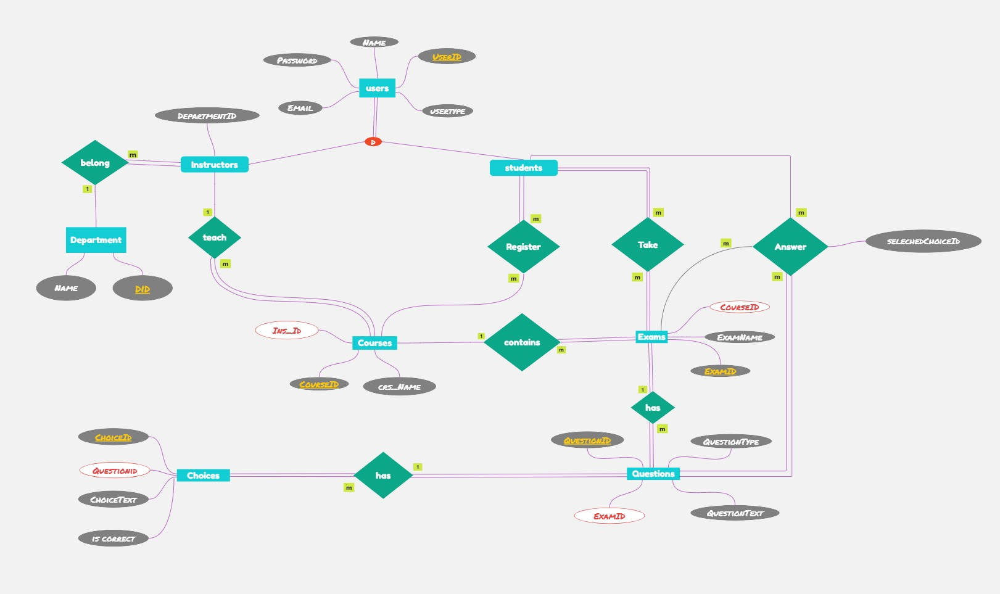

# Online Exam System - Database Schema Reference

## Overview

This document provides a comprehensive reference for the Online Exam System database schema. Each table is described in detail, including its purpose, columns, constraints, and relationships with other tables.

## Core Tables

### Users

**Purpose**: Central repository for all user accounts in the system.

**Columns**:
| Column | Data Type | Description | Constraints |
|--------|-----------|-------------|------------|
| UserID | INT | Unique identifier for each user | Primary Key, IDENTITY(1,1) |
| UserName | VARCHAR(100) | Full name of the user | NOT NULL |
| Email | VARCHAR(100) | Email address for login and communication | UNIQUE, NOT NULL |
| Password | VARCHAR(255) | Hashed password for authentication | NOT NULL |
| UserType | VARCHAR(10) | Discriminator for user role | CHECK (UserType IN ('Student', 'Instructor')) |

**Relationships**:
- One-to-one with Students (Parent)
- One-to-one with Instructors (Parent)

**Notes**:
- The UserType field determines which specialized user table (Students or Instructors) contains additional information for this user.
- Email addresses must be unique across all users.
- Passwords should be stored using secure hashing algorithms, not in plain text.

### Students

**Purpose**: Stores student-specific information and relationships.

**Columns**:
| Column | Data Type | Description | Constraints |
|--------|-----------|-------------|------------|
| UserID | INT | Reference to the Users table | Primary Key, Foreign Key |

**Relationships**:
- One-to-one with Users (Child)
- Many-to-many with Courses (via Student_Course)
- One-to-many with Student_Grades
- One-to-many with Student_Answers

**Notes**:
- This table implements a one-to-one relationship with the Users table through the UserID.
- Additional student-specific attributes could be added to this table as needed.

### Departments

**Purpose**: Represents academic departments within the institution.

**Columns**:
| Column | Data Type | Description | Constraints |
|--------|-----------|-------------|------------|
| DepartmentID | INT | Unique identifier for each department | Primary Key, IDENTITY(1,1) |
| DepartmentName | VARCHAR(100) | Name of the department | UNIQUE, NOT NULL |

**Relationships**:
- One-to-many with Instructors

**Notes**:
- Department names must be unique across the institution.
- This table serves as an organizational unit for instructors.

### Instructors

**Purpose**: Stores instructor-specific information and relationships.

**Columns**:
| Column | Data Type | Description | Constraints |
|--------|-----------|-------------|------------|
| UserID | INT | Reference to the Users table | Primary Key, Foreign Key |
| DepartmentID | INT | Reference to the Departments table | Foreign Key |

**Relationships**:
- One-to-one with Users (Child)
- Many-to-one with Departments
- One-to-many with Courses

**Notes**:
- This table implements a one-to-one relationship with the Users table through the UserID.
- Each instructor belongs to exactly one department.
- Additional instructor-specific attributes could be added to this table as needed.

### Courses

**Purpose**: Represents educational courses offered by the institution.

**Columns**:
| Column | Data Type | Description | Constraints |
|--------|-----------|-------------|------------|
| Course_id | INT | Unique identifier for each course | Primary Key, IDENTITY(1,1) |
| Crs_name | VARCHAR(100) | Name of the course | NOT NULL |
| Ins_id | INT | Reference to the instructor teaching the course | Foreign Key, ON DELETE SET NULL |

**Relationships**:
- Many-to-one with Instructors
- Many-to-many with Students (via Student_Course)
- One-to-many with Exam

**Notes**:
- If an instructor is deleted, the Ins_id field is set to NULL rather than deleting the course.
- Each course is taught by exactly one instructor.

### Student_Course

**Purpose**: Junction table implementing the many-to-many relationship between Students and Courses.

**Columns**:
| Column | Data Type | Description | Constraints |
|--------|-----------|-------------|------------|
| Crs_id | INT | Reference to the Courses table | Primary Key, Foreign Key, ON DELETE CASCADE |
| Std_id | INT | Reference to the Students table | Primary Key, Foreign Key, ON DELETE CASCADE |

**Relationships**:
- Many-to-one with Courses
- Many-to-one with Students

**Notes**:
- The primary key is a composite of both foreign keys.
- Cascading deletes ensure that if a course or student is deleted, the enrollment record is also removed.

## Exam-Related Tables

### Exam

**Purpose**: Represents assessment units within courses.

**Columns**:
| Column | Data Type | Description | Constraints |
|--------|-----------|-------------|------------|
| Exam_id | INT | Unique identifier for each exam | Primary Key, IDENTITY(1,1) |
| Exme_name | VARCHAR(100) | Name of the exam | NOT NULL |
| Crs_id | INT | Reference to the course the exam belongs to | Foreign Key, ON DELETE CASCADE |

**Relationships**:
- Many-to-one with Courses
- One-to-many with Questions
- One-to-many with Student_Grades

**Notes**:
- If a course is deleted, all associated exams are also deleted (cascade).
- Each exam belongs to exactly one course.

### Questions

**Purpose**: Stores individual test items within exams.

**Columns**:
| Column | Data Type | Description | Constraints |
|--------|-----------|-------------|------------|
| Q_id | INT | Unique identifier for each question | Primary Key, IDENTITY(1,1) |
| Exam_id | INT | Reference to the exam the question belongs to | Foreign Key, ON DELETE CASCADE |
| Q_text | TEXT | The text content of the question | NOT NULL |
| Q_type | VARCHAR(20) | The type of question | CHECK (Q_type IN ('MCQ', 'True/False')) |

**Relationships**:
- Many-to-one with Exam
- One-to-many with Choice
- One-to-many with Student_Answers

**Notes**:
- If an exam is deleted, all associated questions are also deleted (cascade).
- The system currently supports two question types: Multiple Choice (MCQ) and True/False.
- The Q_text field can store formatted text for rich question content.

### Choice

**Purpose**: Stores possible answers for questions.

**Columns**:
| Column | Data Type | Description | Constraints |
|--------|-----------|-------------|------------|
| Ch_id | INT | Unique identifier for each choice | Primary Key, IDENTITY(1,1) |
| Q_id | INT | Reference to the question the choice belongs to | Foreign Key, ON DELETE CASCADE |
| ChoiceText | TEXT | The text content of the answer choice | NOT NULL |
| IsCorrect | BIT | Flag indicating if this is the correct answer | NOT NULL |

**Relationships**:
- Many-to-one with Questions
- One-to-many with Student_Answers

**Notes**:
- If a question is deleted, all associated choices are also deleted (cascade).
- For MCQ questions, multiple choices are created with one or more marked as correct.
- For True/False questions, exactly two choices are created (True and False) with one marked as correct.

### Student_Answers

**Purpose**: Records student responses to exam questions.

**Columns**:
| Column | Data Type | Description | Constraints |
|--------|-----------|-------------|------------|
| StudentID | INT | Reference to the student | Primary Key, Foreign Key |
| QuestionID | INT | Reference to the question | Primary Key, Foreign Key |
| ExamID | INT | Reference to the exam | Primary Key, Foreign Key |
| SelectedChoiceID | INT | Reference to the selected answer choice | Foreign Key |

**Relationships**:
- Many-to-one with Students
- Many-to-one with Questions
- Many-to-one with Exam
- Many-to-one with Choice

**Notes**:
- The primary key is a composite of StudentID, QuestionID, and ExamID.
- This design ensures that a student can only provide one answer per question per exam.
- The SelectedChoiceID references the student's selected answer from the Choice table.

### Student_Grades

**Purpose**: Stores aggregated performance metrics for students on exams.

**Columns**:
| Column | Data Type | Description | Constraints |
|--------|-----------|-------------|------------|
| StudentID | INT | Reference to the student | Primary Key, Foreign Key, ON DELETE CASCADE |
| ExamID | INT | Reference to the exam | Primary Key, Foreign Key, ON DELETE CASCADE |
| Grade | DECIMAL(5,2) | The calculated grade for the exam | NOT NULL |

**Relationships**:
- Many-to-one with Students
- Many-to-one with Exam

**Notes**:
- The primary key is a composite of StudentID and ExamID.
- Grades are stored as decimal values with two decimal places, typically representing percentages.
- If a student or exam is deleted, the associated grade records are also deleted (cascade).

## Database Constraints

### Primary Keys
All tables have defined primary keys to ensure entity integrity:
- Single-column primary keys: Users, Departments, Courses, Exam, Questions, Choice
- Composite primary keys: Student_Course, Student_Answers, Student_Grades

### Foreign Keys
Foreign keys maintain referential integrity between related tables:
- All foreign keys have appropriate ON DELETE actions (CASCADE or SET NULL)
- Foreign key constraints prevent orphaned records

### Check Constraints
Check constraints enforce data validity:
- UserType is limited to 'Student' or 'Instructor'
- Q_type is limited to 'MCQ' or 'True/False'

### Unique Constraints
Unique constraints prevent duplicate data:
- Email addresses must be unique across all users
- Department names must be unique

## Indexing Strategy

The database employs the following indexing strategy:

1. **Primary Key Indexes**: Automatically created for all primary keys
2. **Foreign Key Indexes**: Created for foreign key columns to optimize joins
3. **Unique Indexes**: Created for columns with unique constraints (Email, DepartmentName)

## Data Integrity Rules

The database enforces the following data integrity rules:

1. **Entity Integrity**: Primary keys ensure each record is uniquely identifiable
2. **Referential Integrity**: Foreign keys ensure relationships between tables are valid
3. **Domain Integrity**: Data types and constraints ensure values are within acceptable ranges
4. **User-Defined Integrity**: Business rules implemented through check constraints and stored procedures

## Schema Evolution

The database schema includes provisions for evolution:

1. **Identity Columns**: Allow for automatic ID generation without application logic
2. **Nullable Columns**: Where appropriate, allow for optional data
3. **Extensible Enumerations**: Check constraints can be modified to include additional values

## Conclusion

This database schema provides a robust foundation for the Online Exam System. Its well-structured design ensures data integrity while supporting the complex relationships required for managing users, courses, exams, and student performance.

For information on how to use the system built on this database, please refer to the User Guide. For technical details about implementation, see the Technical Documentation. 