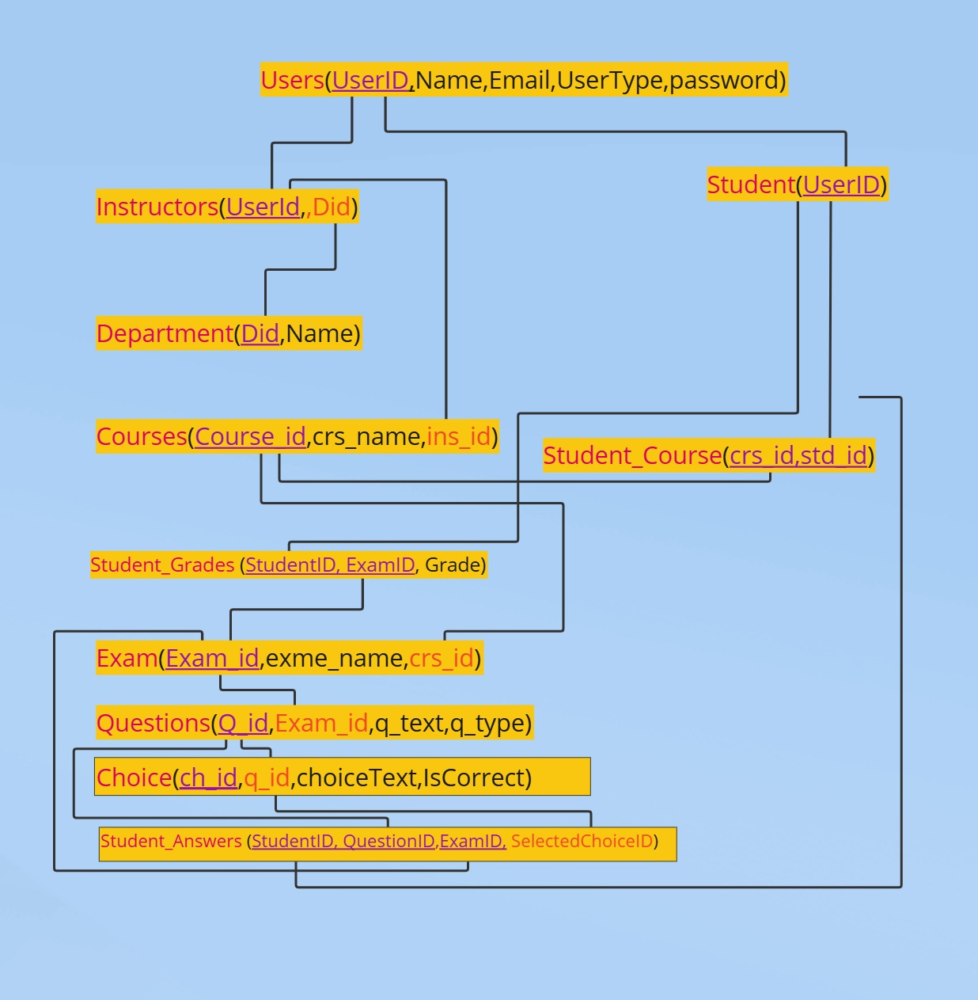

# Online Exam System Documentation

## Overview

This repository contains comprehensive documentation for the Online Exam System, a database-driven application designed to manage educational examinations. The system facilitates the management of users (students and instructors), departments, courses, exams, questions, and student responses.

## Documentation Files

This documentation package includes the following files:

1. **[OnlineExamSystem_Documentation.md](OnlineExamSystem_Documentation.md)** - General overview and comprehensive documentation of the system
2. **[OnlineExamSystem_TechnicalDoc.md](OnlineExamSystem_TechnicalDoc.md)** - Technical details about the system architecture and implementation
3. **[OnlineExamSystem_UserGuide.md](OnlineExamSystem_UserGuide.md)** - User-focused guide explaining how to use the system
4. **[OnlineExamSystem_DatabaseReference.md](OnlineExamSystem_DatabaseReference.md)** - Detailed reference for the database schema
5. **[OnlineExam_Complete.sql](OnlineExam_Complete.sql)** - Complete SQL script for creating the database

## Database Diagrams

The documentation includes several diagrams that illustrate the database structure:

1. **Entity Relationship Diagram (ERD)** - Shows the conceptual data model
   

2. **Mapping Diagram** - Illustrates the relationships between entities
   

3. **Database Diagram** - Displays the physical database implementation
   

## System Features

The Online Exam System includes the following key features:

- **User Management**: Registration, authentication, and role-based access control
- **Course Management**: Creation, enrollment, and instructor assignment
- **Exam Creation**: Manual and automatic generation from question banks
- **Question Management**: Multiple question types (MCQ, True/False)
- **Exam Taking**: Secure exam delivery and answer submission
- **Automatic Grading**: Immediate scoring of objective questions
- **Performance Analytics**: Detailed reporting on student performance

## Technical Implementation

The system is implemented using:

- SQL Server for database management
- Stored procedures for business logic
- Identity columns for automatic ID generation
- Foreign key constraints for data integrity
- User-defined table types for complex data operations

## Getting Started

To implement the Online Exam System:

1. Execute the `OnlineExam_Complete.sql` script in SQL Server Management Studio
2. Develop an application layer (web or desktop) that interfaces with the database
3. Implement user authentication and authorization
4. Create a user interface for the various system functions

## Documentation Structure

Each documentation file serves a specific purpose:

- **General Documentation**: Overview of the entire system
- **Technical Documentation**: Details for developers and system administrators
- **User Guide**: Instructions for end users (students and instructors)
- **Database Reference**: Detailed information about the database schema

## Conclusion

The Online Exam System provides a robust foundation for managing educational examinations. Its well-structured design ensures data integrity while supporting the complex relationships required for a complete examination management solution.

For questions or support, please refer to the appropriate documentation file or contact the system administrator. 