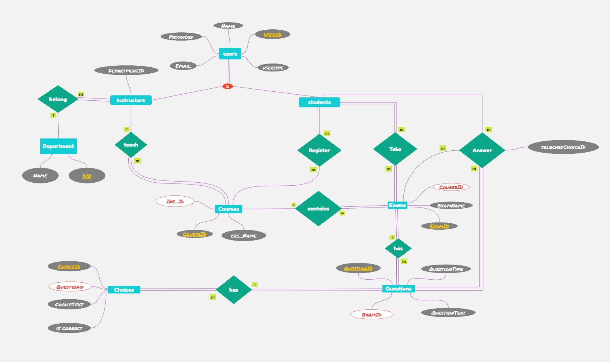

# Online Exam System Documentation

## Introduction

The Online Exam System is a comprehensive solution designed to manage educational institutions' examination processes. The system facilitates the management of users (students and instructors), departments, courses, exams, questions, and student responses. It provides a complete workflow from course enrollment to exam generation, submission, and automatic grading.

## Download Resources

You can download the following resources to implement the system:

- [Download SQL Queries (OnlineExam_Complete.sql)](OnlineExam_Complete.sql)
- [Download Database Backup (online.bak)](online.bak)

## Database Schema

The system is built on a relational database with the following tables:

### Core Tables

1. **Users** - Stores information about all users in the system
   - UserID (PK)
   - Name
   - Email
   - UserType (Student/Instructor)
   - Password

2. **Students** - Stores student-specific information
   - UserID (PK, FK to Users)

3. **Departments** - Stores academic departments
   - DepartmentID (PK)
   - Name

4. **Instructors** - Stores instructor-specific information
   - UserID (PK, FK to Users)
   - DepartmentID (FK to Departments)

5. **Courses** - Stores course information
   - Course_id (PK)
   - Crs_name
   - Ins_id (FK to Instructors)

6. **Student_Course** - Maps students to courses (many-to-many relationship)
   - Crs_id (PK, FK to Courses)
   - Std_id (PK, FK to Students)

### Exam-Related Tables

7. **Exam** - Stores exam information
   - Exam_id (PK)
   - Exme_name
   - Crs_id (FK to Courses)

8. **Questions** - Stores exam questions
   - Q_id (PK)
   - Exam_id (FK to Exam)
   - Q_text
   - Q_type (MCQ/True/False)

9. **Choice** - Stores answer choices for questions
   - Ch_id (PK)
   - Q_id (FK to Questions)
   - ChoiceText
   - IsCorrect

10. **Student_Answers** - Records student responses to exam questions
    - StudentID (PK, FK to Students)
    - QuestionID (PK, FK to Questions)
    - ExamID (PK, FK to Exam)
    - SelectedChoiceID (FK to Choice)

11. **Student_Grades** - Stores student grades for exams
    - StudentID (PK, FK to Students)
    - ExamID (PK, FK to Exam)
    - Grade

## Entity Relationship Diagrams

The system's database structure is represented in the following diagrams:

### ER Diagram


### Mapping Diagram


### Database Diagram


## System Components

### User Management
- User registration and authentication
- Role-based access control (Student/Instructor)
- Profile management

### Department Management
- Department creation and management
- Assignment of instructors to departments

### Course Management
- Course creation and management
- Assignment of instructors to courses
- Student enrollment in courses

### Exam Management
- Exam creation and configuration
- Question bank management
- Automatic and manual exam generation
- Multiple question types support (MCQ, True/False)

### Exam Taking
- Secure exam delivery to students
- Answer submission and validation
- Time management for exams

### Grading System
- Automatic grading of objective questions
- Grade calculation and recording
- Performance analytics

## Stored Procedures

The system implements numerous stored procedures to handle various operations. Below is a detailed guide on how to use each stored procedure:

### User Management Procedures

#### `InsertUser`
Adds a new user to the system.

**Parameters:**
- `@UserID` - Unique identifier for the user
- `@UserName` - Full name of the user
- `@Email` - Email address (must be unique)
- `@Password` - User's password
- `@UserType` - Type of user ('Student' or 'Instructor')

**Usage Example:**
```sql
EXEC InsertUser 
    @UserID = 5, 
    @UserName = 'Ahmed Ali', 
    @Email = 'ahmed@example.com', 
    @Password = 'securePassword123', 
    @UserType = 'Student';
```

#### `UpdateUser`
Updates information for an existing user.

**Parameters:**
- `@UserID` - ID of the user to update
- `@UserName` - New name for the user
- `@Email` - New email address
- `@Password` - New password
- `@UserType` - New user type

**Usage Example:**
```sql
EXEC UpdateUser 
    @UserID = 5, 
    @UserName = 'Ahmed Mohamed Ali', 
    @Email = 'ahmed.ali@example.com', 
    @Password = 'newSecurePassword456', 
    @UserType = 'Student';
```

#### `DeleteUser`
Removes a user from the system.

**Parameters:**
- `@UserID` - ID of the user to delete

**Usage Example:**
```sql
EXEC DeleteUser @UserID = 5;
```

#### `GetUser`
Retrieves information about a specific user.

**Parameters:**
- `@UserID` - ID of the user to retrieve

**Usage Example:**
```sql
EXEC GetUser @UserID = 3;
```

### Student Management Procedures

#### `InsertStudent`
Registers a new student in the system. Note that the user must already exist in the Users table.

**Parameters:**
- `@UserID` - ID of the user to register as a student

**Usage Example:**
```sql
EXEC InsertStudent @UserID = 5;
```

#### `DeleteStudent`
Removes a student from the system.

**Parameters:**
- `@UserID` - ID of the student to delete

**Usage Example:**
```sql
EXEC DeleteStudent @UserID = 5;
```

#### `UpdateStudent`
Updates a student's user ID.

**Parameters:**
- `@OldUserID` - Current user ID of the student
- `@NewUserID` - New user ID to assign

**Usage Example:**
```sql
EXEC UpdateStudent @OldUserID = 5, @NewUserID = 6;
```

#### `GetStudent`
Retrieves information about a specific student.

**Parameters:**
- `@UserID` - ID of the student to retrieve

**Usage Example:**
```sql
EXEC GetStudent @UserID = 1;
```

#### `GetAllStudents`
Lists all students in the system.

**Usage Example:**
```sql
EXEC GetAllStudents;
```

### Department Management Procedures

#### `InsertDepartment`
Creates a new department.

**Parameters:**
- `@DepartmentID` - Unique identifier for the department
- `@DepartmentName` - Name of the department

**Usage Example:**
```sql
EXEC InsertDepartment 
    @DepartmentID = 3, 
    @DepartmentName = 'Software Engineering';
```

#### `UpdateDepartment`
Updates information for an existing department.

**Parameters:**
- `@DepartmentID` - ID of the department to update
- `@NewDepartmentName` - New name for the department

**Usage Example:**
```sql
EXEC UpdateDepartment 
    @DepartmentID = 3, 
    @NewDepartmentName = 'Software Development';
```

#### `DeleteDepartment`
Removes a department from the system.

**Parameters:**
- `@DepartmentID` - ID of the department to delete

**Usage Example:**
```sql
EXEC DeleteDepartment @DepartmentID = 3;
```

#### `GetDepartment`
Retrieves information about a specific department.

**Parameters:**
- `@DepartmentID` - ID of the department to retrieve

**Usage Example:**
```sql
EXEC GetDepartment @DepartmentID = 1;
```

#### `GetAllDepartments`
Lists all departments in the system.

**Usage Example:**
```sql
EXEC GetAllDepartments;
```

### Instructor Management Procedures

#### `sp_InsertInstructor`
Assigns an instructor to a department. Note that the user must already exist in the Users table.

**Parameters:**
- `@UserID` - ID of the user to assign as an instructor
- `@DepartmentID` - ID of the department to assign the instructor to

**Usage Example:**
```sql
EXEC sp_InsertInstructor 
    @UserID = 4, 
    @DepartmentID = 2;
```

#### `sp_UpdateInstructor`
Updates the department assignment for an instructor.

**Parameters:**
- `@UserID` - ID of the instructor to update
- `@DepartmentID` - New department ID to assign

**Usage Example:**
```sql
EXEC sp_UpdateInstructor 
    @UserID = 4, 
    @DepartmentID = 1;
```

#### `sp_DeleteInstructor`
Removes an instructor from the system.

**Parameters:**
- `@UserID` - ID of the instructor to delete

**Usage Example:**
```sql
EXEC sp_DeleteInstructor @UserID = 4;
```

#### `sp_GetInstructor`
Retrieves information about a specific instructor.

**Parameters:**
- `@UserID` - ID of the instructor to retrieve

**Usage Example:**
```sql
EXEC sp_GetInstructor @UserID = 3;
```

#### `sp_GetAllInstructors`
Lists all instructors in the system along with their department information.

**Usage Example:**
```sql
EXEC sp_GetAllInstructors;
```

### Course Management Procedures

#### `sp_InsertCourse`
Creates a new course.

**Parameters:**
- `@Course_id` - Unique identifier for the course
- `@Crs_name` - Name of the course
- `@Ins_id` - ID of the instructor teaching the course

**Usage Example:**
```sql
EXEC sp_InsertCourse 
    @Course_id = 103, 
    @Crs_name = 'Advanced Programming', 
    @Ins_id = 3;
```

#### `sp_UpdateCourse`
Updates information for an existing course.

**Parameters:**
- `@Course_id` - ID of the course to update
- `@Crs_name` - New name for the course
- `@Ins_id` - New instructor ID for the course

**Usage Example:**
```sql
EXEC sp_UpdateCourse 
    @Course_id = 103, 
    @Crs_name = 'Advanced Programming Techniques', 
    @Ins_id = 4;
```

#### `sp_DeleteCourse`
Removes a course from the system.

**Parameters:**
- `@Course_id` - ID of the course to delete

**Usage Example:**
```sql
EXEC sp_DeleteCourse @Course_id = 103;
```

#### `sp_GetCourse`
Retrieves information about a specific course.

**Parameters:**
- `@Course_id` - ID of the course to retrieve

**Usage Example:**
```sql
EXEC sp_GetCourse @Course_id = 101;
```

#### `sp_GetAllCourses`
Lists all courses in the system along with instructor information.

**Usage Example:**
```sql
EXEC sp_GetAllCourses;
```

#### `sp_EnrollStudentInCourse`
Enrolls a student in a course.

**Parameters:**
- `@StudentID` - ID of the student to enroll
- `@CourseID` - ID of the course to enroll in

**Usage Example:**
```sql
EXEC sp_EnrollStudentInCourse 
    @StudentID = 1, 
    @CourseID = 102;
```

#### `sp_UnenrollStudentFromCourse`
Removes a student from a course.

**Parameters:**
- `@StudentID` - ID of the student to unenroll
- `@CourseID` - ID of the course to unenroll from

**Usage Example:**
```sql
EXEC sp_UnenrollStudentFromCourse 
    @StudentID = 1, 
    @CourseID = 102;
```

### Exam Management Procedures

#### `sp_InsertExam`
Creates a new exam.

**Parameters:**
- `@Exam_id` - Unique identifier for the exam
- `@Exam_name` - Name of the exam
- `@Crs_id` - ID of the course the exam belongs to

**Usage Example:**
```sql
EXEC sp_InsertExam 
    @Exam_id = 203, 
    @Exam_name = 'Quiz 1', 
    @Crs_id = 101;
```

#### `sp_UpdateExam`
Updates information for an existing exam.

**Parameters:**
- `@Exam_id` - ID of the exam to update
- `@Exam_name` - New name for the exam
- `@Crs_id` - New course ID for the exam

**Usage Example:**
```sql
EXEC sp_UpdateExam 
    @Exam_id = 203, 
    @Exam_name = 'Quiz 1 - Revised', 
    @Crs_id = 102;
```

#### `sp_DeleteExam`
Removes an exam from the system.

**Parameters:**
- `@Exam_id` - ID of the exam to delete

**Usage Example:**
```sql
EXEC sp_DeleteExam @Exam_id = 203;
```

#### `sp_GetExam`
Retrieves information about a specific exam.

**Parameters:**
- `@Exam_id` - ID of the exam to retrieve

**Usage Example:**
```sql
EXEC sp_GetExam @Exam_id = 201;
```

#### `sp_GetExamsByCourse`
Lists all exams for a specific course.

**Parameters:**
- `@CourseID` - ID of the course to get exams for

**Usage Example:**
```sql
EXEC sp_GetExamsByCourse @CourseID = 101;
```

#### `sp_GetAllExams`
Lists all exams in the system.

**Usage Example:**
```sql
EXEC sp_GetAllExams;
```

### Question Management Procedures

#### `InsertQuestion`
Adds a question to an exam.

**Parameters:**
- `@Q_id` - Unique identifier for the question
- `@Exam_id` - ID of the exam the question belongs to
- `@Q_text` - Text of the question
- `@Q_type` - Type of question ('MCQ' or 'True/False')

**Usage Example:**
```sql
EXEC InsertQuestion 
    @Q_id = 303, 
    @Exam_id = 201, 
    @Q_text = 'What is normalization in database design?', 
    @Q_type = 'MCQ';
```

#### `UpdateQuestion`
Updates information for an existing question.

**Parameters:**
- `@Q_id` - ID of the question to update
- `@NewExam_id` - New exam ID for the question
- `@NewQ_text` - New text for the question
- `@NewQ_type` - New type for the question

**Usage Example:**
```sql
EXEC UpdateQuestion 
    @Q_id = 303, 
    @NewExam_id = 201, 
    @NewQ_text = 'Explain the concept of normalization in database design.', 
    @NewQ_type = 'MCQ';
```

#### `DeleteQuestion`
Removes a question from the system.

**Parameters:**
- `@Q_id` - ID of the question to delete

**Usage Example:**
```sql
EXEC DeleteQuestion @Q_id = 303;
```

#### `GetQuestions`
Lists all questions in the system.

**Usage Example:**
```sql
EXEC GetQuestions;
```

#### `GetQuestionsByExam`
Lists all questions for a specific exam.

**Parameters:**
- `@ExamID` - ID of the exam to get questions for

**Usage Example:**
```sql
EXEC GetQuestionsByExam @ExamID = 201;
```

#### `GetQuestionsByType`
Lists all questions of a specific type.

**Parameters:**
- `@QuestionType` - Type of questions to retrieve ('MCQ' or 'True/False')

**Usage Example:**
```sql
EXEC GetQuestionsByType @QuestionType = 'MCQ';
```

### Choice Management Procedures

#### `InsertChoice`
Adds an answer choice to a question.

**Parameters:**
- `@Ch_id` - Unique identifier for the choice
- `@Q_id` - ID of the question the choice belongs to
- `@ChoiceText` - Text of the choice
- `@IsCorrect` - Whether the choice is correct (1) or not (0)

**Usage Example:**
```sql
EXEC InsertChoice 
    @Ch_id = 405, 
    @Q_id = 303, 
    @ChoiceText = 'The process of organizing data to minimize redundancy', 
    @IsCorrect = 1;
```

#### `UpdateChoice`
Updates information for an existing choice.

**Parameters:**
- `@Ch_id` - ID of the choice to update
- `@NewQ_id` - New question ID for the choice
- `@NewChoiceText` - New text for the choice
- `@NewIsCorrect` - New correctness value for the choice

**Usage Example:**
```sql
EXEC UpdateChoice 
    @Ch_id = 405, 
    @NewQ_id = 303, 
    @NewChoiceText = 'The process of organizing data in a database to reduce redundancy and improve data integrity', 
    @NewIsCorrect = 1;
```

#### `DeleteChoice`
Removes a choice from the system.

**Parameters:**
- `@Ch_id` - ID of the choice to delete

**Usage Example:**
```sql
EXEC DeleteChoice @Ch_id = 405;
```

#### `GetChoices`
Lists all choices in the system.

**Usage Example:**
```sql
EXEC GetChoices;
```

#### `GetChoicesByQuestion`
Lists all choices for a specific question.

**Parameters:**
- `@QuestionID` - ID of the question to get choices for

**Usage Example:**
```sql
EXEC GetChoicesByQuestion @QuestionID = 301;
```

#### `GetCorrectChoices`
Lists all correct choices in the system.

**Usage Example:**
```sql
EXEC GetCorrectChoices;
```

### Student Grades Management Procedures

#### `InsertStudentGrade`
Records a grade for a student on an exam.

**Parameters:**
- `@StudentID` - ID of the student
- `@ExamID` - ID of the exam
- `@Grade` - Grade value (typically a percentage)

**Usage Example:**
```sql
EXEC InsertStudentGrade 
    @StudentID = 2, 
    @ExamID = 201, 
    @Grade = 92.50;
```

#### `UpdateStudentGrade`
Updates a student's grade for an exam.

**Parameters:**
- `@StudentID` - ID of the student
- `@ExamID` - ID of the exam
- `@NewGrade` - New grade value

**Usage Example:**
```sql
EXEC UpdateStudentGrade 
    @StudentID = 2, 
    @ExamID = 201, 
    @NewGrade = 95.00;
```

#### `DeleteStudentGrade`
Removes a grade record from the system.

**Parameters:**
- `@StudentID` - ID of the student
- `@ExamID` - ID of the exam

**Usage Example:**
```sql
EXEC DeleteStudentGrade 
    @StudentID = 2, 
    @ExamID = 201;
```

#### `GetStudentGrades`
Lists all grade records in the system.

**Usage Example:**
```sql
EXEC GetStudentGrades;
```

#### `GetStudentGradesByExam`
Lists all grades for a specific exam.

**Parameters:**
- `@ExamID` - ID of the exam to get grades for

**Usage Example:**
```sql
EXEC GetStudentGradesByExam @ExamID = 201;
```

#### `GetStudentGradesByStudent`
Lists all grades for a specific student.

**Parameters:**
- `@StudentID` - ID of the student to get grades for

**Usage Example:**
```sql
EXEC GetStudentGradesByStudent @StudentID = 1;
```

### Student Answers Management Procedures

#### `InsertStudentAnswer`
Records a student's answer to a question on an exam.

**Parameters:**
- `@StudentID` - ID of the student
- `@QuestionID` - ID of the question
- `@ExamID` - ID of the exam
- `@SelectedChoiceID` - ID of the selected choice

**Usage Example:**
```sql
EXEC InsertStudentAnswer 
    @StudentID = 1, 
    @QuestionID = 301, 
    @ExamID = 201, 
    @SelectedChoiceID = 401;
```

#### `UpdateStudentAnswer`
Updates a student's answer to a question.

**Parameters:**
- `@StudentID` - ID of the student
- `@QuestionID` - ID of the question
- `@ExamID` - ID of the exam
- `@NewSelectedChoiceID` - ID of the new selected choice

**Usage Example:**
```sql
EXEC UpdateStudentAnswer 
    @StudentID = 1, 
    @QuestionID = 301, 
    @ExamID = 201, 
    @NewSelectedChoiceID = 402;
```

#### `DeleteStudentAnswer`
Removes an answer record from the system.

**Parameters:**
- `@StudentID` - ID of the student
- `@QuestionID` - ID of the question
- `@ExamID` - ID of the exam

**Usage Example:**
```sql
EXEC DeleteStudentAnswer 
    @StudentID = 1, 
    @QuestionID = 301, 
    @ExamID = 201;
```

#### `GetStudentAnswers`
Lists all answer records in the system.

**Usage Example:**
```sql
EXEC GetStudentAnswers;
```

#### `GetStudentAnswersByExam`
Lists all answers for a specific student on a specific exam.

**Parameters:**
- `@StudentID` - ID of the student
- `@ExamID` - ID of the exam

**Usage Example:**
```sql
EXEC GetStudentAnswersByExam 
    @StudentID = 1, 
    @ExamID = 201;
```

#### `GetCorrectStudentAnswers`
Lists all correct answers for a specific student on a specific exam.

**Parameters:**
- `@StudentID` - ID of the student
- `@ExamID` - ID of the exam

**Usage Example:**
```sql
EXEC GetCorrectStudentAnswers 
    @StudentID = 1, 
    @ExamID = 201;
```

### Advanced Procedures

#### `GenerateExam`
Automatically generates an exam from a question bank.

**Parameters:**
- `@ExamName` - Name for the new exam
- `@CourseID` - ID of the course the exam belongs to
- `@NumMCQ` - Number of multiple-choice questions to include
- `@NumTF` - Number of true/false questions to include

**Usage Example:**
```sql
EXEC GenerateExam 
    @ExamName = 'Auto-Generated Quiz', 
    @CourseID = 101, 
    @NumMCQ = 5, 
    @NumTF = 3;
```

#### `SubmitExamAnswers`
Processes student exam submissions and automatically grades them.

**Parameters:**
- `@StudentID` - ID of the student submitting the exam
- `@ExamID` - ID of the exam being submitted
- `@Answers` - Table of answers (QuestionID, SelectedChoiceID)

**Usage Example:**
```sql
-- First, declare a variable of the AnswerTableType
DECLARE @StudentAnswers AS AnswerTableType;

-- Insert answers into the table variable
INSERT INTO @StudentAnswers (QuestionID, SelectedChoiceID)
VALUES (301, 401), (302, 404);

-- Submit the answers
EXEC SubmitExamAnswers 
    @StudentID = 1, 
    @ExamID = 201, 
    @Answers = @StudentAnswers;
```

#### `ExamCorrection`
Automatically grades an exam for a student.

**Parameters:**
- `@ExamID` - ID of the exam to grade
- `@StudentID` - ID of the student to grade

**Usage Example:**
```sql
EXEC ExamCorrection 
    @ExamID = 201, 
    @StudentID = 1;
```

## System Workflows

### Instructor Workflow
1. Instructor logs into the system
2. Creates/manages courses
3. Creates exams for courses
4. Adds questions and answer choices to exams
5. Reviews student performance and grades

### Student Workflow
1. Student logs into the system
2. Enrolls in courses
3. Takes available exams
4. Submits answers
5. Reviews grades and performance

### Exam Creation Workflow
1. Instructor creates a new exam for a course
2. Adds questions manually or generates from question bank
3. Configures exam settings
4. Makes exam available to enrolled students

### Exam Taking Workflow
1. Student selects an available exam
2. System presents questions one by one or all at once
3. Student submits answers
4. System automatically grades objective questions
5. System records grades and provides feedback

## Technical Implementation

The system is implemented using:
- SQL Server for database management
- Stored procedures for business logic
- Identity columns for automatic ID generation
- Foreign key constraints for data integrity
- User-defined table types for complex data operations
- Transaction management for data consistency

The database schema includes both a basic version and an enhanced version with identity columns for automatic ID generation. The system supports various operations through a comprehensive set of stored procedures that handle everything from basic CRUD operations to complex workflows like exam generation and automatic grading.

## Implementation Guide

To implement the Online Exam System in your environment:

### Using the SQL Script
1. Download the [OnlineExam_Complete.sql](OnlineExam_Complete.sql) file
2. Open SQL Server Management Studio
3. Connect to your SQL Server instance
4. Create a new database named "OnlineExam" (or your preferred name)
5. Open the downloaded SQL script
6. Execute the script to create all tables, constraints, and stored procedures

### Using the Database Backup
1. Download the [online.bak](online.bak) file
2. Open SQL Server Management Studio
3. Connect to your SQL Server instance
4. Right-click on "Databases" and select "Restore Database..."
5. Select "Device" as the source and browse to the downloaded .bak file
6. Specify the database name and click "OK" to restore

### Next Steps
1. Develop a user interface (web or desktop application)
2. Implement authentication and authorization
3. Connect your application to the database
4. Test the system with sample data 